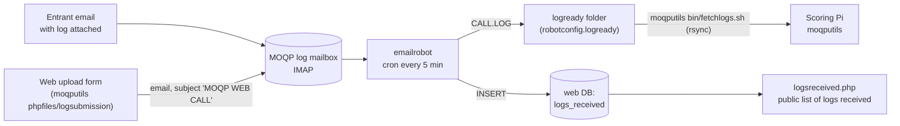

# emailrobot: repo familiarization notes

Status: first pass, September 2026. These notes record what the MOQP log intake robot does, how it is deployed, and what it depends on. They do not propose fixes. Items that look like defects are listed as observations for later triage.

Sources: this fork (`kawfey/emailrobot`, `master` at `03749d4`, identical to `N0SO/emailrobot` `master`) and a read-only clone of `N0SO/emailrobot` with all its branches. For the wider MOQP picture, see `repo-familiarization.md` in `kawfey/moqputils` and `kawfey/cabrillolog`. No code was run: `cabrillofilter.py` imports `cabrilloutils`, which is not in any public repo, and the robot needs a live mailbox and database.

## Contents

1. [Summary](#summary)
2. [Where it sits in the MOQP flow](#where-it-sits-in-the-moqp-flow)
3. [Repo map](#repo-map)
4. [What one run does](#what-one-run-does)
5. [Configuration](#configuration)
6. [Deployment on the w0ma.org host](#deployment-on-the-w0maorg-host)
7. [Unmerged upstream branch for moqp.org](#unmerged-upstream-branch-for-moqporg)
8. [Dependencies](#dependencies)
9. [History](#history)
10. [Observations noticed in passing](#observations-noticed-in-passing)
11. [Open questions](#open-questions)

## Summary

- emailrobot is a small Python 3 program (about 380 lines). Cron runs it every 5 minutes. It reads new mail in the MOQP log mailbox over IMAP, checks each attachment for Cabrillo format, saves good logs as `<CALL>.LOG`, and adds one row per saved log to the `logs_received` table. The "logs received" web pages read that table.
- Log submissions that come through the web upload form arrive in the same mailbox, with a subject that starts `MOQP WEB`. The robot records those as `RECEIVED_BY='WEB'`.
- The March 2026 version (V3.0.0) runs on the w0ma.org cPanel host. The acknowledgement emails are turned off in that version (`robotmail.py` is present but not called).
- Upstream has an unmerged branch, `1-updating-code-for-the-new-moqporg-server` (August 2026, V3.1.1). It moves the robot to the moqp.org server and writes to the database through an SSH tunnel. Your fork does not have that branch.
- `cabrillofilter.py` depends on the private `cabrilloutils` package (`CabrilloUtils.getLogdictData`, `stripCallsign`).

## Where it sits in the MOQP flow



## Repo map

| File | Role |
|---|---|
| `emailrobot.py` | class `emailRobot`: IMAP loop, attachment handling, file save, database insert (V3.0.0) |
| `cabrillofilter.py` | class `CabrilloFilter(CabrilloUtils)`: parses log text into a dict with `HEADER` (V1.0.2) |
| `robotmail.py` | class `robotMail`: SMTP messages to the submitter and to the log processors. Not called in V3.0.0 |
| `logrobot` | entry script: `emailRobot(True)` |
| `runmail` | shell wrapper for cron: `cd` to the install folder, activate `.venv`, `cd emailrobot`, run `./logrobot` |
| `moqprobot-crontab.txt` | cron line used on the w0ma.org host |
| `sample-robotconfig.py` | template for the git-ignored `robotconfig.py` |
| `__init__.py` | `VERSION = '2.0.0'` (older than the code's V3.0.0) |

## What one run does

`emailRobot.main()`:

1. Log in to `imap_host` on port 993 as `imap_user`, folder `INBOX`.
2. Fetch every message not yet seen (`AND(seen=False)`). `imap_tools` marks fetched messages as seen, so each message is handled once.
3. For each attachment:
   - Only attachments with content type `application/octet-stream` are examined.
   - The payload is decoded as UTF-8 and passed to `CabrilloFilter.main()`, which returns a dict. If the dict has a `HEADER`, the log is treated as Cabrillo.
   - `saveFile` strips the callsign (`/M`, `/R` and so on) with `stripCallsign`. If the callsign has 3 or more characters, it writes the text to `logready + CALL.LOG`. A later log from the same call overwrites the earlier file.
   - `createDBEntry` inserts into `logs_received`: `STA_CALL` (stripped call), `OP_NAME` (header `NAME`), `EMAIL` (Reply-To, else From), `RECEIVED_BY` (`WEB` if the subject has `WEB`, else `EMAIL`), `FILENAME`, `DATE_REC` (UTC `YYYY-MM-DD-HH-MM-SS`), `EMAILSUBJ`, `ATT_NUM` (attachment index from 1).
4. Print one line per attachment and `+++ Log Entry Accepted +++` or `*** Log Entry REJECTED ***` per message. Cron appends this output to `robotlog.txt`.

Attachments that are not Cabrillo, and messages with no attachment, are not saved or recorded. The only trace is the robot log line, and the message stays in the mailbox (marked as seen).

## Configuration

`robotconfig.py` (git-ignored; copy from `sample-robotconfig.py`):

| Name | Use |
|---|---|
| `imap_host`, `imap_user`, `imap_pass` | mailbox login (IMAP 993; `robotMail` also uses this host for SMTP on port 25) |
| `dbusername`, `dbpassword`, `dbhostname`, `dbname` | MySQL for `logs_received` (sample name `my_w0ma_moqp`) |
| `logroot`, `logpath`, `logwait`, `logready`, `logfurther` | log folders. `emailrobot.py` uses only `logready`. The `robotMail` text mentions a `humanreview` folder (`logfurther`), but no code writes to it |
| `LOGPROCESSORS`, `ROBOTSENDER` | addresses for `robotMail` |
| `TUNNEL_*` | only on the unmerged moqp.org branch (see below) |

`logs_received` schema: `shared/sample-logsreceived-w0ma_moqp.sql` in moqputils (April 2020). That sample has no `ATT_NUM` column, so the live table must have had it added after 2020.

## Deployment on the w0ma.org host

From `moqprobot-crontab.txt` and `runmail` on `master`:

```
SHELL="/usr/local/cpanel/bin/jailshell"
*/5 * * * * /home/w0ma/moqputils/bin/runmail >>/home/w0ma/mo_qso_party/results/2026/robotlog.txt 2>&1
```

- The install folder is `/home/w0ma/moqputils`, with a Python virtual environment in `.venv` and the robot in `emailrobot/` under it. The cron line calls `bin/runmail`, but in this repo `runmail` is at the top level, so the host layout is not the same as the repo layout.
- The year (`2026`) is part of the robot log path in the cron line.
- `cabrilloutils` must be importable from the venv. The commit of 2026-03-12 says a symlink to `CabrilloUtils` or a link in the venv `site-packages` is used.
- moqputils `bin/fetchlogs.sh` then copies `/home/w0ma/mo_qso_party/results/<YEAR>/logs` from this host to the Pi with rsync. That path is not the `logready` value in the sample config; the live `robotconfig.py` probably points there.

## Unmerged upstream branch for moqp.org

`N0SO/emailrobot` branch `1-updating-code-for-the-new-moqporg-server`: 2 commits ahead of `master` (2026-08-17: "saving changes", "Adding venv requirements.txt file."), 0 behind. `V300` is equal to `master`.

| Change | Detail |
|---|---|
| Version | V3.1.1, "Updating for use on moqp.org instead of w0ma.org" |
| Database access | `createDBEntry` opens an SSH tunnel (`sshtunnel.SSHTunnelForwarder`) to `TUNNEL_HOST_PORT` with `TUNNEL_USER` and a key (`TUNNEL_KEY`), then connects `pymysql` to the local tunnel port. `TUNNEL_BIND_ADDR` defaults to `127.0.0.1:3306` on the server. |
| Config | new `TUNNEL_HOST_PORT`, `TUNNEL_USER`, `TUNNEL_PASS`, `TUNNEL_KEY`, `TUNNEL_BIND_ADDR` in `sample-robotconfig.py` |
| `runmail` | install folder changes from `/home/w0ma/moqputils` to `/home/maps` |
| `requirements.txt` (new) | `imap-tools 1.15.0`, `PyMySQL 1.2.0`, `sshtunnel2 0.4.1`, `paramiko 5.0.0`, `cryptography 50.0.0` and their dependencies |

This suggests that for 2027 the robot runs on a different machine from the database (it reaches MySQL over SSH), and that `/home/maps` is the moqpmaps install on the new server. The crontab file is not changed on the branch.

## Dependencies

| Package | Used for | Available? |
|---|---|---|
| `imap_tools` | IMAP login and fetch | PyPI |
| `pymysql` | `logs_received` insert | PyPI |
| `cabrilloutils.CabrilloUtils` | Cabrillo parse (`getLogdictData`, `getLogdict`), `stripCallsign` | **no**, private (probably `/home/pi/Projects/` on the Pi and a copy on the web host) |
| `sshtunnel` / `paramiko` | moqp.org branch only | PyPI |
| `smtplib`, `email` | `robotMail` | standard library |

## History

- 16 commits on `master`. Commits from 2020-04 to 2022-03 were made while the robot was part of the moqputils tree. The code moved to its own repo on 2026-03-07 ("Moving emailrobot to its own repo"). That move also brought an `emailrobot.php` that is no longer in the repo.
- 2022 (V2.0.0): the host gained Python SQL support, so the PHP helper for database writes was removed. Commits refer to issues #11 to #15, probably in the moqputils tracker (not checked).
- 2026-03 (V3.0.0): the host update broke the old robot. It was rewritten for Python 3 with `imap_tools` and `pymysql`, and set up for cron in a venv. The commit on 2026-03-11 says "Ack e-mails currently disabled".
- 2026-08: moqp.org branch (unmerged, see above).

## Observations noticed in passing

These were found while reading the code. Nothing here was confirmed by running it.

1. Only `application/octet-stream` attachments are examined. A `.log` or `.cbr` file that a mail client sends as `text/plain` would be rejected without a note to anyone. The acknowledgement emails are off, so the entrant does not learn this either.
2. `payload.decode('utf-8')` raises an exception on a log saved in another encoding (for example Latin-1 names in the header). That would stop the run. The messages after it would wait for the next run, and the same message would not be retried, because it is already marked as seen.
3. A resubmitted log overwrites `CALL.LOG` but adds a second `logs_received` row. The public list uses `SELECT DISTINCT STA_CALL`, so it still shows one entry.
4. `emailRobot.getVersion()` returns `self.VERSION`, which is never set on the instance (the version is a module variable), so the call would raise `AttributeError`.
5. `robotMail.process_badlog` calls `sendrobotmail` with 3 arguments; it needs 4. `process_goodlog` still points entrants to `http://w0ma.org/mo_qso_party/logsubmission/logsreceived.php`. The `__main__` test block sends to a hard-coded personal address.
6. `robotMail.sendrobotmail` logs in to SMTP on port 25 of the IMAP host without TLS.
7. On the moqp.org branch, `requirements.txt` lists `sshtunnel2` while the code imports `sshtunnel`. Whether `sshtunnel2` provides that module name needs a check.

## Open questions

1. Which host runs the robot for 2027: the old w0ma.org cPanel host or the new moqp.org server (`/home/maps`)? Should the moqp.org branch be brought into your fork?
2. Which mailbox does the robot read, and is `moqsoparty@w0ma.org` (still in the 2026 rules) moving to a moqp.org address?
3. Where does `logready` point on the live host, and does that match the path that `fetchlogs.sh` copies to the Pi?
4. Should the acknowledgement emails (`robotMail`) be turned back on for 2027?
5. Where is the live `logs_received` schema (with `ATT_NUM`), and which host holds that database after the move?
